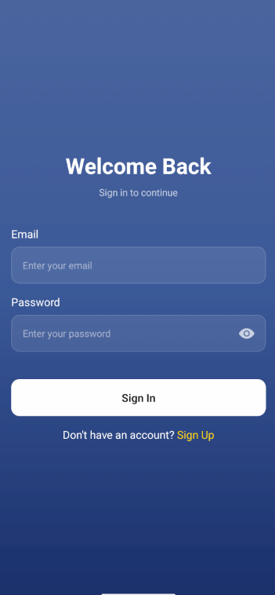
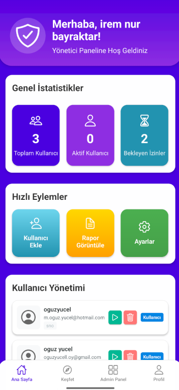
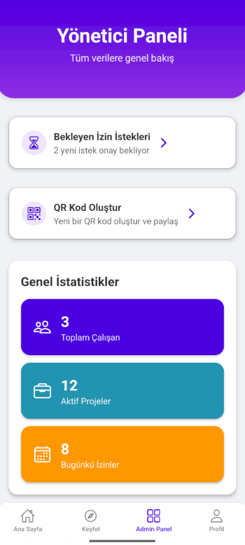
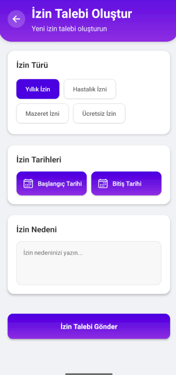
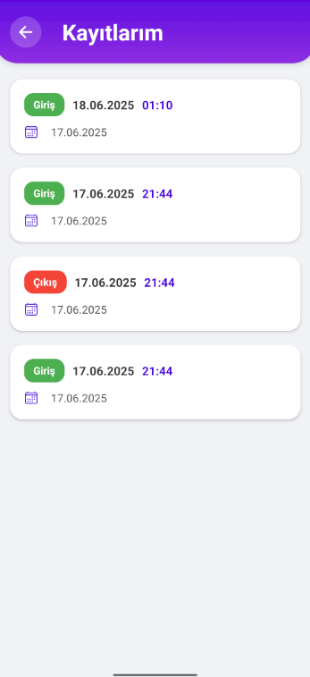
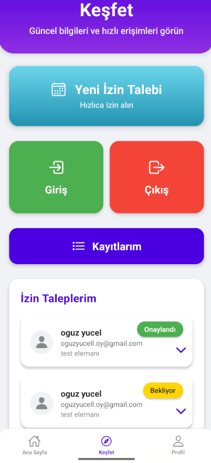

# 📲 StaffApp - Personel Giriş/Çıkış ve İzin Takip Sistemi


**StaffApp**, kurum personelinin günlük giriş/çıkış işlemlerini QR kod ile dijital olarak kayıt altına alan ve izin/ders doldurma taleplerini yöneten mobil uygulamadır. Hem kullanıcılar (personeller) hem de yöneticiler (admin) için optimize edilmiş iki ayrı panel içerir.

---

## 🚀 Özellikler

- ✅ **QR Kod ile Giriş/Çıkış Takibi**
  - Her gün yöneticinin oluşturduğu QR kod ile personel, giriş/çıkış yapar.
  - Tüm loglar tarih ve saat bilgisiyle kaydedilir.

- 📅 **İzin ve Ders Doldurma Modülü**
  - Personel izin talebi gönderir.
  - Yönetici, izin saatinde dersi kimin devralacağını manuel girer.

- 🔒 **Gerçek Zamanlı Supabase Entegrasyonu**
  - Tüm veriler Supabase Postgres veritabanında tutulur.
  - Gerçek zamanlı kayıt ve admin panelinde anında görüntüleme.

- 🌗 **Modern ve Şık Arayüz**
  - React Native + Expo ile geliştirildi.
  - iOS ve Android desteği.

---

## 🛠️ Teknolojiler

| Katman       | Teknoloji                     |
|--------------|-------------------------------|
| Mobil        | React Native + Expo           |
| Backend      | Supabase (Auth, DB, Storage)  |
| State        | React Hooks + Context         |
| Build        | EAS Build / OTA Updates       |
| Veritabanı   | PostgreSQL (Supabase)         |
| QR / Kamera  | Expo Camera & QR Scanner      |

---

## 🏗️ Proje Yapısı (YAML Formatında)

```
staffapp/
  app/: # Sayfa ve yönlendirme sistemi (expo-router)
  assets/: # Uygulama ikonları, splash ekranı, arka plan görselleri
  lib/:
    supabase.ts: # Supabase client ve auth yapılandırması
  components/: # Özel oluşturulmuş component'lar
  .env: # Supabase URL ve Anon Key ortam değişkenleri
  app.config.js: # Expo yapılandırması, EAS için ortam değişkenleri okunur
  eas.json: # Build ortamları (development, preview, production) yapılandırması
```

## 🔐 Güvenlik

- Supabase projesinde **Row Level Security (RLS)** aktif .
- Giriş/çıkış ve izin loglarında **yalnızca yetkili kullanıcılar** işlem yapabilir.
- `.env` dosyası build'e **gömülmez**, yalnızca `EXPO_PUBLIC_` prefix'li environment değişkenleri uygulamaya alınır.

---

## 👥 Katkı Sağlamak

✨ Pull request ve katkılara açığız!

- Öneri, hata bildirimi veya geliştirme için **issue açabilirsin**.
- Lütfen açıklayıcı commit mesajları kullan ve mümkünse ekran görüntüsü ekle.

---
## 📸 Ekran Görüntüleri

Aşağıda uygulamanın bazı temel ekran görüntüleri yer almaktadır:

### 🔐 Giriş Ekranı
Kullanıcıların uygulamaya erişim sağladığı basit ve güvenli giriş arayüzü.



---

### 📷 Ana Sayfa
Admin'in bütün istatistikleri görebildiği ve yönetimlere erişebildiği arayüz.



---

### 🧑‍💼 Admin Paneli
Yöneticilerin günlük QR kod oluşturduğu, giriş/çıkışları ve izinleri görüntülediği panel.



---

### 📝 İzin Talep Formu
Personellerin ders saati ve neden belirterek izin başvurusunda bulunduğu ekran.



---

### 📊 Kayıt Listesi
Tarih ve personele göre filtrelenmiş giriş/çıkış kayıtlarının görüntülendiği log ekranı.



---

### 📊 Kullanıcı Ekranı
Kullanıcıların izin durumlarını görüntülediği ve karekodlarını okutabildiği arayüz.




